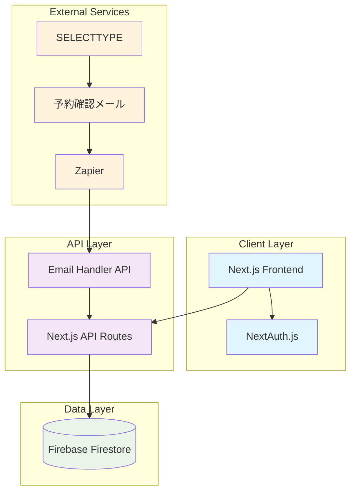
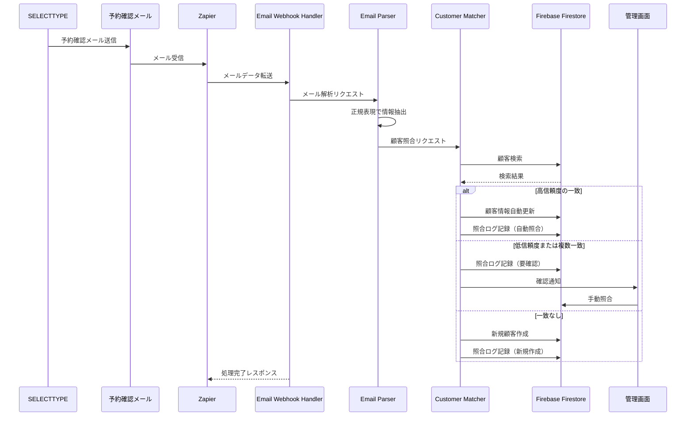

# Design Document

## Overview

既存のReact + Firebase顧客管理ダッシュボードを、Next.js + TypeScriptを使用してモダンに再構築し、SELECTTYPEとの予約システム連携機能をZapierを介して追加する。Firebaseを継続利用しつつ、Vercelでのデプロイとgit管理を実現し、高品質なUIとパフォーマンスを提供する。

## Architecture

### Technology Stack

**Frontend:**
- Next.js 14 (App Router)
- TypeScript
- Tailwind CSS + shadcn/ui
- React Hook Form + Zod (バリデーション)
- TanStack Query (データフェッチング)

**Backend:**
- Next.js API Routes
- Firebase SDK (Firestore)
- NextAuth.js (認証)

**External Integrations:**
- Zapier (SELECTTYPEメール連携)
- Firebase (データベース)

**Deployment & DevOps:**
- Vercel (ホスティング)
- GitHub (バージョン管理)
- ESLint + Prettier (コード品質)

### System Architecture



## Components and Interfaces

### Firestore データモデル

```typescript
// Firestore コレクション構造
interface Customer {
  id: string;            // ドキュメントID
  name: string;          // 顧客名
  email?: string;        // メールアドレス
  phone?: string;        // 電話番号
  plan: 'ベーシック' | 'スタンダード' | 'プレミアム';  // プラン種別
  status: '契約締結' | '入金済み' | '事前ノウハウ学習済み' | '初回カウンセリング済み';  // ステータス
  contractDate?: string; // 契約日 (YYYY-MM-DD)
  makeupCount: number;   // メイク実施回数
  hairCount: number;     // ヘア実施回数
  fashionCount: number;  // ファッション実施回数
  nextDate?: string;     // 次回対応予定日 (YYYY-MM-DD)
  nextContent?: string;  // 次回対応内容
  createdAt: Timestamp;  // 作成日時
  updatedAt: Timestamp;  // 更新日時
  
  // SELECTTYPE連携用
  reservations?: Reservation[];  // 予約履歴
}

interface Reservation {
  id: string;            // 予約ID
  customerId: string;    // 顧客ID
  reservationDate: string; // 予約日 (YYYY-MM-DD)
  menuName: string;      // メニュー名
  status: 'confirmed' | 'cancelled' | 'completed'; // 予約ステータス
  createdAt: Timestamp;  // 作成日時
  updatedAt: Timestamp;  // 更新日時
}

interface IntegrationSettings {
  id: string;            // 設定ID
  zapierWebhookUrl: string; // ZapierのWebhook URL
  emailParsingRules: {   // メール解析ルール
    subjectPattern: string; // 件名のパターン
    bodyPatterns: {      // 本文の解析パターン
      customerName: string;  // 顧客名抽出パターン
      reservationDate: string; // 予約日抽出パターン
      menuName: string;     // メニュー名抽出パターン
    }
  };
  isActive: boolean;     // 有効/無効
  createdAt: Timestamp;  // 作成日時
  updatedAt: Timestamp;  // 更新日時
}

interface CustomerMatchLog {
  id: string;            // ログID
  emailData: {           // 受信したメールデータ
    subject: string;     // メール件名
    body: string;        // メール本文
    receivedAt: string;  // 受信日時
  };
  extractedData: {       // 抽出されたデータ
    customerName?: string;  // 顧客名
    reservationDate?: string; // 予約日
    menuName?: string;     // メニュー名
  };
  matchedCustomerId?: string; // マッチした顧客ID
  matchMethod: 'PHONE_AND_NAME' | 'EMAIL_AND_NAME' | 'NAME_ONLY' | 'MANUAL'; // 照合方法
  confidence: number;    // 照合の信頼度 (0.0-1.0)
  isManualMatch: boolean; // 手動照合かどうか
  duplicateCount: number; // 重複候補数
  notes?: string;        // メモ
  createdAt: Timestamp;  // 作成日時
}

interface DuplicateAlert {
  id: string;            // アラートID
  primaryCustomerId: string; // 主となる顧客ID
  duplicateCustomerId: string; // 重複している顧客ID
  similarity: number;    // 類似度スコア (0.0-1.0)
  status: 'PENDING' | 'RESOLVED' | 'IGNORED'; // ステータス
  resolvedBy?: string;   // 解決者
  resolvedAt?: Timestamp; // 解決日時
  createdAt: Timestamp;  // 作成日時
}
```
```

### API Endpoints

```typescript
// API Routes Structure
/api/
├── customers/
│   ├── route.ts              // GET, POST /api/customers
│   └── [id]/
│       └── route.ts          // GET, PUT, DELETE /api/customers/[id]
├── reservations/
│   ├── route.ts              // GET, POST /api/reservations
│   └── [id]/
│       └── route.ts          // GET, PUT, DELETE /api/reservations/[id]
├── integrations/
│   ├── zapier/
│   │   ├── email-webhook/
│   │   │   └── route.ts      // POST /api/integrations/zapier/email-webhook
│   │   └── settings/
│   │       └── route.ts      // GET, PUT /api/integrations/zapier/settings
│   └── email-parser/
│       └── route.ts          // POST /api/integrations/email-parser
└── auth/
    └── [...nextauth]/
        └── route.ts          // NextAuth.js endpoints
```

### Frontend Components Structure

```typescript
// Component Architecture
src/
├── app/
│   ├── (dashboard)/
│   │   ├── customers/
│   │   │   ├── page.tsx                    // 顧客一覧ページ
│   │   │   ├── [id]/
│   │   │   │   └── page.tsx                // 顧客詳細ページ
│   │   │   └── new/
│   │   │       └── page.tsx                // 新規顧客作成ページ
│   │   ├── reservations/
│   │   │   └── page.tsx                    // 予約一覧ページ
│   │   ├── settings/
│   │   │   └── page.tsx                    // 設定ページ
│   │   └── layout.tsx                      // ダッシュボードレイアウト
│   ├── api/                                // API Routes
│   ├── globals.css
│   ├── layout.tsx                          // ルートレイアウト
│   └── page.tsx                            // ホームページ
├── components/
│   ├── ui/                                 // shadcn/ui components
│   ├── customers/
│   │   ├── CustomerTable.tsx
│   │   ├── CustomerForm.tsx
│   │   ├── CustomerCard.tsx
│   │   └── CustomerFilters.tsx
│   ├── reservations/
│   │   ├── ReservationList.tsx
│   │   └── ReservationCard.tsx
│   ├── layout/
│   │   ├── Header.tsx
│   │   ├── Sidebar.tsx
│   │   └── Navigation.tsx
│   └── common/
│       ├── LoadingSpinner.tsx
│       ├── ErrorBoundary.tsx
│       └── ConfirmDialog.tsx
├── lib/
│   ├── firebase.ts                         // Firebase client
│   ├── auth.ts                             // NextAuth configuration
│   ├── validations/                        // Zod schemas
│   ├── utils.ts                            // Utility functions
│   └── constants.ts                        // Constants
├── hooks/
│   ├── useCustomers.ts
│   ├── useReservations.ts
│   └── useIntegrations.ts
└── types/
    ├── customer.ts
    ├── reservation.ts
    └── api.ts
```

## Data Models

### Customer Data Model

```typescript
interface Customer {
  id: string
  name: string
  email?: string
  phone?: string
  plan: 'ベーシック' | 'スタンダード' | 'プレミアム'
  status: '契約締結' | '入金済み' | '事前ノウハウ学習済み' | '初回カウンセリング済み'
  contractDate?: string // YYYY-MM-DD形式
  makeupCount: number
  hairCount: number
  fashionCount: number
  nextDate?: string // YYYY-MM-DD形式
  nextContent?: string
  createdAt: Timestamp
  updatedAt: Timestamp
  reservations?: Reservation[]
}
```

### Zapier メール連携モデル

```typescript
interface ZapierEmailPayload {
  subject: string;           // メールの件名
  body: string;              // メールの本文（HTMLまたはテキスト）
  from: string;              // 送信者メールアドレス
  to: string;                // 受信者メールアドレス
  date: string;              // 受信日時
  attachments?: string[];    // 添付ファイル（あれば）
}

interface EmailParsingResult {
  customerName?: string;     // 抽出した顧客名
  reservationDate?: string;  // 抽出した予約日
  menuName?: string;         // 抽出した予約メニュー名
  status?: string;           // 予約ステータス（確定/キャンセル）
  confidence: number;        // 抽出の信頼度 (0.0-1.0)
  rawData: ZapierEmailPayload; // 元のメールデータ
}

interface ZapierSettings {
  webhookUrl: string;        // ZapierからのWebhook受信URL
  emailTemplatePatterns: {   // メール解析用パターン
    subject: string;         // 件名のパターン（正規表現）
    customerName: string;    // 顧客名抽出パターン
    reservationDate: string; // 予約日抽出パターン
    menuName: string;        // メニュー名抽出パターン
  };
  isActive: boolean;         // 連携が有効かどうか
}

interface CustomerMatchResult {
  customer?: Customer;
  confidence: number;
  method: 'PHONE_AND_NAME' | 'EMAIL_AND_NAME' | 'NAME_ONLY' | 'MANUAL';
  duplicates: Customer[];
  requiresManualReview: boolean;
}

interface DuplicateDetectionResult {
  hasDuplicates: boolean;
  duplicateGroups: {
    similarity: number;
    customers: Customer[];
  }[];
}
```

## Error Handling

### Error Types

```typescript
enum ErrorCode {
  VALIDATION_ERROR = 'VALIDATION_ERROR',
  NOT_FOUND = 'NOT_FOUND',
  UNAUTHORIZED = 'UNAUTHORIZED',
  INTEGRATION_ERROR = 'INTEGRATION_ERROR',
  DATABASE_ERROR = 'DATABASE_ERROR'
}

interface ApiError {
  code: ErrorCode
  message: string
  details?: any
}
```

### Error Handling Strategy

1. **Client-side Error Handling:**
   - React Error Boundaries for UI errors
   - TanStack Query error handling for API errors
   - Toast notifications for user feedback

2. **Server-side Error Handling:**
   - Centralized error handler middleware
   - Structured error responses
   - Error logging with context

3. **Integration Error Handling:**
   - Zapierメール連携のエラーハンドリング
   - Webhook受信時の検証とエラーレスポンス
   - メール解析失敗時のフォールバック機能

## Testing Strategy

### Testing Pyramid

1. **Unit Tests (Jest + Testing Library):**
   - Component testing
   - Utility function testing
   - Validation schema testing

2. **Integration Tests:**
   - API route testing
   - Database operation testing
   - Zapierメール連携テスト

3. **E2E Tests (Playwright):**
   - Critical user flows
   - Cross-browser compatibility
   - Mobile responsiveness

### Test Coverage Goals

- Unit tests: 80%+ coverage
- Integration tests: Key API endpoints
- E2E tests: Critical user journeys

## Performance Optimization

### Frontend Optimization

1. **Code Splitting:**
   - Route-based code splitting with Next.js
   - Component lazy loading
   - Dynamic imports for heavy components

2. **Data Fetching:**
   - Server-side rendering for initial load
   - Client-side caching with TanStack Query
   - Optimistic updates for better UX

3. **UI Performance:**
   - Virtual scrolling for large lists
   - Image optimization with Next.js Image
   - CSS-in-JS optimization with Tailwind

### Backend Optimization

1. **Database Optimization:**
   - Proper indexing strategy
   - Query optimization for Firestore
   - Efficient data structure design

2. **API Optimization:**
   - Response caching where appropriate
   - Pagination for large datasets
   - Rate limiting for external APIs

## Security Considerations

### Authentication & Authorization

1. **NextAuth.js Implementation:**
   - Email/password authentication
   - Session management
   - CSRF protection

2. **API Security:**
   - JWT token validation
   - Rate limiting
   - Input validation with Zod

### Data Protection

1. **Sensitive Data Handling:**
   - Environment variable management
   - API key encryption
   - PII data protection

2. **Zapier連携のセキュリティ:**
   - Webhook署名検証
   - API鍵のローテーション戦略
   - 認証情報の安全な保存

## SELECTTYPE連携の詳細設計

### 顧客照合ロジック

```typescript
// 顧客照合の優先順位と実装
async function matchCustomerFromEmailData(emailData) {
  const { customerName, customerEmail, customerPhone } = emailData;
  
  // 1. 電話番号 + 名前での照合（最も信頼性が高い）
  if (customerPhone) {
    const phoneMatches = await db.collection('customers')
      .where('phone', '==', customerPhone)
      .get()
      .then(snapshot => {
        const matches = [];
        snapshot.forEach(doc => {
          const data = doc.data();
          if (data.name.toLowerCase().includes(customerName.toLowerCase())) {
            matches.push({ id: doc.id, ...data });
          }
        });
        return matches;
      });
    
    if (phoneMatches.length === 1) {
      return {
        customer: phoneMatches[0],
        confidence: 0.95,
        method: 'PHONE_AND_NAME',
        duplicates: [],
        requiresManualReview: false
      };
    } else if (phoneMatches.length > 1) {
      // 同じ電話番号で複数顧客が見つかった場合
      return {
        customer: phoneMatches[0], // 最初の顧客を仮選択
        confidence: 0.7,
        method: 'PHONE_AND_NAME',
        duplicates: phoneMatches,
        requiresManualReview: true
      };
    }
  }
  
  // 2. メールアドレス + 名前での照合
  if (customerEmail) {
    const emailMatches = await db.collection('customers')
      .where('email', '==', customerEmail)
      .get()
      .then(snapshot => {
        const matches = [];
        snapshot.forEach(doc => {
          const data = doc.data();
          if (data.name.toLowerCase().includes(customerName.toLowerCase())) {
            matches.push({ id: doc.id, ...data });
          }
        });
        return matches;
      });
    
    if (emailMatches.length === 1) {
      return {
        customer: emailMatches[0],
        confidence: 0.9,
        method: 'EMAIL_AND_NAME',
        duplicates: [],
        requiresManualReview: false
      };
    } else if (emailMatches.length > 1) {
      return {
        customer: emailMatches[0],
        confidence: 0.65,
        method: 'EMAIL_AND_NAME',
        duplicates: emailMatches,
        requiresManualReview: true
      };
    }
  }
  
  // 3. 名前のみでの照合（あいまい検索）
  // Firestoreは完全一致しかサポートしていないため、クライアント側でフィルタリング
  const nameSnapshot = await db.collection('customers').get();
  const nameMatches = [];
  
  nameSnapshot.forEach(doc => {
    const data = doc.data();
    if (data.name.toLowerCase().includes(customerName.toLowerCase())) {
      nameMatches.push({ id: doc.id, ...data });
    }
  });
  
  if (nameMatches.length === 1) {
    return {
      customer: nameMatches[0],
      confidence: 0.7,
      method: 'NAME_ONLY',
      duplicates: [],
      requiresManualReview: false
    };
  } else if (nameMatches.length > 1) {
    // 名前が複数一致した場合、最も最近予約した顧客を選択
    const sortedMatches = nameMatches.sort((a, b) => {
      if (!a.nextDate) return 1;
      if (!b.nextDate) return -1;
      return new Date(b.nextDate).getTime() - new Date(a.nextDate).getTime();
    });
    
    return {
      customer: sortedMatches[0],
      confidence: 0.5,
      method: 'NAME_ONLY',
      duplicates: nameMatches,
      requiresManualReview: true
    };
  }
  
  // 4. 一致する顧客が見つからない場合
  return {
    customer: undefined,
    confidence: 0,
    method: 'NAME_ONLY',
    duplicates: [],
    requiresManualReview: false
  };
}
```

### 照合ログと重複チェックの管理画面

```typescript
// 管理画面コンポーネント構造
src/
├── app/
│   ├── (dashboard)/
│   │   ├── integration/
│   │   │   ├── logs/
│   │   │   │   ├── page.tsx                // 照合ログ一覧
│   │   │   │   └── [id]/
│   │   │   │       └── page.tsx            // 照合ログ詳細
│   │   │   └── duplicates/
│   │   │       ├── page.tsx                // 重複アラート一覧
│   │   │       └── [id]/
│   │   │           └── page.tsx            // 重複解決ページ
```

#### 照合ログ画面の機能

1. **照合ログ一覧:**
   - 日時、顧客名、照合方法、信頼度のリスト表示
   - フィルタリング（日付、照合方法、信頼度）
   - 手動確認が必要なログのハイライト

2. **照合ログ詳細:**
   - メールデータの全表示
   - 照合結果の詳細（選択された顧客、照合方法）
   - 手動照合機能（別の顧客を選択可能）
   - 照合履歴（同じ顧客の過去の照合記録）

#### 重複チェック画面の機能

1. **重複アラート一覧:**
   - 類似度スコアでソートされた重複顧客のペア
   - ステータス（未確認、解決済み、無視）でフィルタリング
   - 一括解決アクション

2. **重複解決ページ:**
   - 2つの顧客情報を並べて表示
   - 差分のハイライト表示
   - 解決アクション：
     - マージ（両方の情報を統合）
     - プライマリ選択（どちらかを正とする）
     - 無視（重複ではないとマーク）

### Zapierメール連携処理フロー



## デプロイと移行戦略

### 既存Firebaseアプリからの移行

1. **コードベース移行:**
   - React + Viteから Next.js + TypeScriptへの段階的移行
   - 既存のFirebaseデータ構造を維持
   - 新機能の追加（Zapier連携、照合ログなど）

2. **デプロイ戦略:**
   - Vercelへのデプロイ設定
   - 環境変数の適切な管理
   - CI/CDパイプラインの構築

3. **運用移行計画:**
   - 段階的な機能リリース
   - ユーザートレーニング
   - モニタリングとフィードバック収集